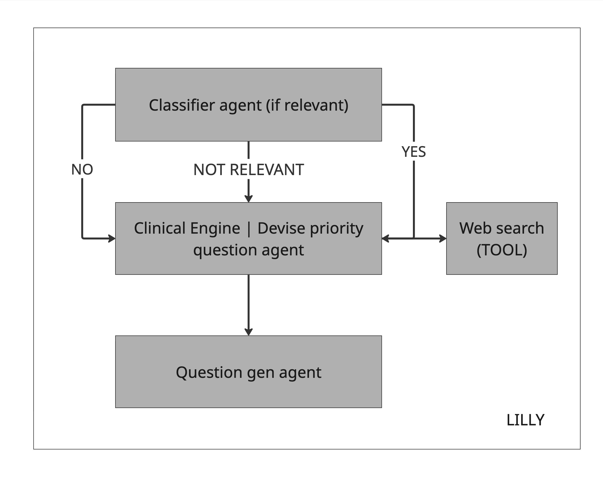

# Align-Main

Main repo of Alignhealthtech. Align piloted in urgent care from March to June
2026; the company has since wound down, and this repo is kept as a record of
what was built.

- **Frontend**: one Next.js app per clinical segment — `urgent-care-app` is the
  one that exists
- **Backend**: a single FastAPI service hosting both the API layer and the
  LangGraph orchestration engine
- **Database**: one unified Postgres instance intended to be shared across
  segments and across LangGraph's checkpointer and the business tables.
  **Designed but never connected** — the schema, migrations and row-level
  security policies are in `apps/api-server/db/` and `alembic/versions/`, but
  `db/models` is imported only by `alembic/env.py`. Sessions live in process
  memory, so a restart clears them.

## Live demo

<https://demo.alignhealthtech.com>

Both panes run side by side in one browser session: the patient intake on the
left, the clinician dashboard on the right, updating as answers are submitted.
Answer in Korean or Chinese and the clinician side stays English. The question
engine runs for real against Azure OpenAI.

Deployed as two containers in a single Azure Container App — the Next server
proxies to the API over localhost, so the API has no public ingress. Scaled to
one replica because sessions are in-memory; scale-to-zero means the first
request after an idle period pays a cold start.

---

## 1. Tech stack

| Layer               | Choice                                                |
| ------------------- | ----------------------------------------------------- |
| Backend framework   | FastAPI (Python)                                      |
| Orchestration       | LangGraph                                             |
| ORM                 | SQLAlchemy (ORM) + Alembic (Migrations)               |
| DB                  | Postgres — schema and migrations only, never wired in |
| Frontend            | Next.js, one app per segment                          |
| Type contract       | Pydantic → OpenAPI → `openapi-typescript`             |
| FHIR target version | R4 (not currently in scope)                           |
| FHIR server         | Microsoft FHIR service (not currently in scope)       |
| CI                  | GitHub Actions — typecheck/lint/build + backend tests  |
| Deployment          | Docker, two containers in one Azure Container App      |

---

## 2. Agent structure



| Agent                         | Job                                                | Input                                                                                                 | Output                                                                                                                         |
| ----------------------------- | -------------------------------------------------- | ----------------------------------------------------------------------------------------------------- | ------------------------------------------------------------------------------------------------------------------------------ |
| **Classifier agent**          | Binary/categorical judgment                        | Free-text patient input                                                                               | A classification (e.g. physical/localised vs non-localised)                                                                    |
| **Devise & Prioritise agent** | Clinical reasoning — decide _what_ should be asked | Previous conversation state + curated Healthify / Health NZ evidence for priority and red-flag phases | Ranked `TopicCandidate` values with source, brief rationale, validated evidence URLs, and red-flag markers (not questions yet) |
| **Question Generation agent** | Conversational reasoning — decide _how_ to ask it  | Topic list + conversation context                                                                     | A batch of natural-language questions or a single question                                                                     |

### Why Devise & Prioritise is a separate agent

David/Kevin are building a clinical reasoning capability in parallel. When it is
ready, replace `run_devise_and_prioritise` in `intelligence/agents.py` (or its
body) — keep returning `list[TopicCandidate]`. There is no separate
`ClinicalReasoningProvider` Protocol to swap.

### Graph node flow

Clinical intake only (LangGraph). Consent and survey are **router-level** —
see [ROUTER_SPEC.md](docs/structures/ROUTER_SPEC.md) and [USERFLOW.md](docs/structures/USERFLOW.md).

```
presenting_complaint           (classifier: localised? Y/N)   ← GRAPH START
    ├─ Yes → localised_detail
    └─ No  → non_localised_detail
  → priority_questions
  → redflag_screening
  → optional_questions         (skippable)
  → ice
  → review                     (silent; clinician encounter_summary only)
  → complete                   ← GRAPH END
```

Before graph: router serves consent (`NOT_STARTED` → `IN_PROGRESS`).
After graph: router may serve survey, then final complete.

---

### Per-segment apps

Three Next.js apps in the monorepo, one per clinical segment. Only `urgent-care-app` is being actively built for the demo; `physio-app` and `gp-app` are scaffolded (folders + shared config) but empty until their segment goes live.

```
Align-Main/
├── apps/
│   ├── physio-app/          # not build yet
│   ├── urgent-care-app/      # Next.Js frontend app
│   ├── gp-app/                 # not built yet
│   └── api-server/             # FastAPI + LangGraph, single Python process
│       ├── routers/            # session / clinician mark-complete
│       ├── engine/             # LangGraph + agent_bridge + session_state_mappers
│       ├── intelligence/       # agents + prompts (CI patches engine.agent_bridge)
│       ├── external_systems/   # pms/ only (Protocol + adapters)
│       ├── schemas/            # SessionState, NextStep, clinical AI I/O shapes
│       ├── urls/               # reviewed Healthify / Health NZ evidence catalogues
│       └── db/                 # SQLAlchemy models, Alembic migrations
├── packages/
│   ├── generated-types/       # openapi-typescript output — never hand-edit
│   └── ui/                     # shared frontend components
└── docker-compose.yml          # local Postgres + api-server
```

---

## 3. Local setup

New teammates: follow **[docs/setup/LOCAL.md](docs/setup/LOCAL.md)** (Docker Postgres, Python venv, Alembic, RLS roles, `npm run dev`).

---

## 4. Specific Documents

- [Local setup](docs/setup/LOCAL.md)
- [API structure](docs/apps/api-server/APISTRUCTURE.md)
- [Database schema](docs/database/DATABASE.md)
- [Database RLS](docs/database/RLS.md)
- [Repository conventions](docs/repository-rule/REPOSITORYRULE.md)
- [Structure ideation](docs/structures/STRUCTURE.md)
- [User flow (graph)](docs/structures/USERFLOW.md)
- [Router lifecycle spec](docs/structures/ROUTER_SPEC.md)
