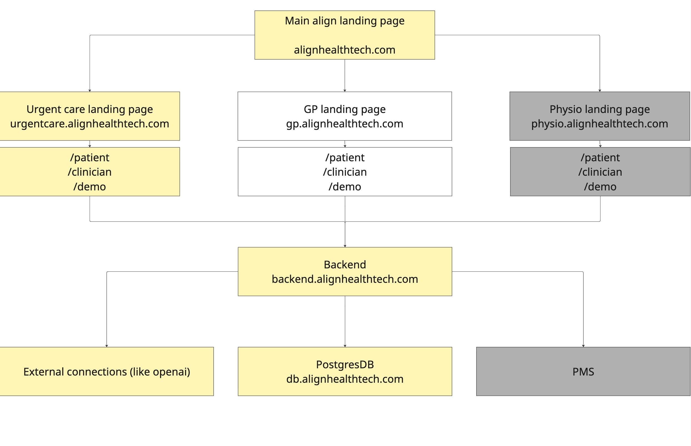

# Align-Main

This is the main repo of Alignhealthtech.

The app will consist of:

- **Frontend**: one Next.js app per clinical segment
- **Backend**: a single FastAPI service that hosts both the API layer and the LangGraph orchestration engine
- **Database**: one unified Postgres instance, shared across segments and across LangGraph's checkpointer and our own business tables

---

## 1. Tech stack


| Layer               | Choice                                                |
| ------------------- | ----------------------------------------------------- |
| Backend framework   | FastAPI (Python)                                      |
| Orchestration       | LangGraph                                             |
| ORM                 | SQLAlchemy (ORM) + Alembic (Migrations)               |
| DB                  | Local Postgres now → Supabase or Azure Postgres later |
| Frontend            | Next.js, one app per segment                          |
| Type contract       | Pydantic → OpenAPI → `openapi-typescript`             |
| FHIR target version | R4 (not currently in scope)                           |
| FHIR server         | Microsoft FHIR service (not currently in scope)       |
| CI/CD               | GitHub Actions + pre-commit hooks                     |
| Deployment          | Docker containers, one per app                        |


---

## 2. Agent structure


| Agent                         | Job                                                | Input                                                    | Output                                                       |
| ----------------------------- | -------------------------------------------------- | -------------------------------------------------------- | ------------------------------------------------------------ |
| **Classifier agent**          | Binary/categorical judgment                        | Free-text patient input                                  | A classification (e.g. physical/localised vs non-localised)  |
| **Devise & Prioritise agent** | Clinical reasoning — decide *what* should be asked | Previous conversation state + tools (web search for now) | Ranked list of topics + red flag markers (not questions yet) |
| **Question Generation agent** | Conversational reasoning — decide *how* to ask it  | Topic list + conversation context                        | A batch of natural-language questions or a single question   |


### Why Devise & Prioritise is a separate agent

David/Kevin are building a clinical reasoning capability in parallel. When it is
ready, replace `run_devise_and_prioritise` in `clinical_ai/agents.py` (or its
body) — keep returning `list[TopicCandidate]`. There is no separate
`ClinicalReasoningProvider` Protocol to swap.

### Graph node flow

```
patient_registration           (deterministic form)
  → presenting_complaint_agent (classifier: localised? Y/N)
      ├─ Yes → localised_detail_agent   (question_gen: body diagram, severity, duration, radiation)
      └─ No  → non_localised_agent      (question_gen: severity, duration, frequency)
  → devise_and_prioritise + priority_questions_agent (question_gen, max 4)
  → devise_and_prioritise(phase=redflag_screening) + redflag question_gen
  → optional_questions_agent    (devise + question_gen, user can skip)
  → ice_agent                   (question_gen: ideas/concerns/expectations)
  → review_node                 (run_nurse_review_summary_agent → ReviewSummaryResult)
  → optional_survey_node        (deterministic form)
```

---

### Per-segment apps

Three Next.js apps in the monorepo, one per clinical segment. Only `urgent-care-app` is being actively built for the demo; `physio-app` and `gp-app` are scaffolded (folders + shared config) but empty until their segment goes live.

```
Align-Main/
├── apps/
│   ├── physio-app/          # not build yet
│   ├── urgent-care-app/      # Next.Js frontend app
│   ├── gp-app/                 # not built yet
│   └── api-server/             # FastAPI + LangGraph, single Python process
│       ├── routers/            # session / clinician / demo (scaffold)
│       ├── engine/             # graph + nodes (scaffold)
│       ├── external_systems/   # pms/ (Protocol+adapters), clinical_ai/ (run_* agents)
│       ├── schemas/            # SessionState, NextStep, clinical_ai I/O, …
│       └── db/                 # SQLAlchemy models, Alembic migrations
├── packages/
│   ├── generated-types/       # openapi-typescript output — never hand-edit
│   └── ui/                     # shared frontend components
└── docker-compose.yml          # local Postgres + api-server
```

---

## 3. System diagram

High-level layout: one marketing landing page, three segment frontends (urgent care / GP / physio), one shared FastAPI backend, Postgres, external AI providers, and PMS adapters.



### Route structure (per app)

```
/patient/organisation_id   — Not in a current scope
/clinician/...                       — Not in a current scope
/demo/...                            — Public endpoint showing both patient demo and clinician portal
middleware
```

---

## 4. Local setup

New teammates: follow **[docs/setup/LOCAL.md](docs/setup/LOCAL.md)** (Docker Postgres, Python venv, Alembic, RLS roles, `npm run dev`).

---

## 5. Specific Documents

- [Local setup](docs/setup/LOCAL.md)
- [API structure](docs/apps/api-server/APISTRUCTURE.md)
- [Database schema](docs/database/DATABASE.md)
- [Database RLS](docs/database/RLS.md)
- [Repository conventions](docs/repository-rule/REPOSITORYRULE.md)
- [Structure ideation](docs/structures/structure.md)

