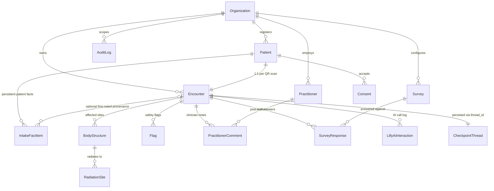

# Align Database Schema — Technical Reference

Internal technical requirement document for the demo build. Reflects the finalized schema after trimming the original Prisma-generated dump down to what's actually needed, and mapping the FHIR-shaped tables.

---

## 1. Entity Relationship Diagram




`CheckpointThread` isn't a real table — it's `checkpoints`/`checkpoint_writes`/`checkpoint_blobs`, keyed by `thread_id`, where `thread_id == encounters.id` (as text). LangGraph owns these; we just make sure the ID lines up.

`segment_type` lives directly on `organizations` as an enum (`PHYSIO \| URGENT_CARE \| GP`), not a separate reference table.

---

## 2. Table reference

### Timestamp convention


| Mixin / columns                                | Used on                                                           |
| ---------------------------------------------- | ----------------------------------------------------------------- |
| `created_at` + `updated_at` (`TimestampMixin`) | Every application table **except** the two below                  |
| `created_at` only (`CreatedAtMixin`)           | `audit_logs`, `survey_responses` — append-only; never update rows |


Checkpoint tables are owned by LangGraph and follow its own schema.

---

### `organizations`

**FHIR: `Organization`**. Renamed from `clinics`. The tenant. Everything else hangs off `organization_id`.


| Column                     | Purpose                                                                                                           |
| -------------------------- | ----------------------------------------------------------------------------------------------------------------- |
| `id`, `name`, `slug`       | Identity (`slug` unique)                                                                                          |
| `segment_type`             | Postgres enum: `PHYSIO | URGENT_CARE | GP`                                                                        |
| `pms_config`               | jsonb — vendor / practice identity (not secrets)                                                                  |
| `pms_integration_config`   | jsonb, adapter-specific credentials — kept separate from `pms_config` since this holds secrets, not identity info |
| `created_at`, `updated_at` | Timestamps                                                                                                        |


---

### `patients`

**FHIR: `Patient`**. Renamed from `guest_patients` — a `kind` column distinguishes guest / registered / demo instead of the table name doing it.


| Column                                         | Purpose                                                                                                                                                                             |
| ---------------------------------------------- | ----------------------------------------------------------------------------------------------------------------------------------------------------------------------------------- |
| `organization_id`                              | Tenant scope                                                                                                                                                                        |
| `kind`                                         | `GUEST` (QR scan, no PMS match) | `REGISTERED` | `DEMO`                                                                                                                             |
| `given_name`, `family_name`, `name_prefix`     | FHIR `Patient.name` (HumanName)                                                                                                                                                     |
| `nhi_number`, `dob`                            | Core identifiers                                                                                                                                                                    |
| `gender`                                       | Administrative/social gender — FHIR core                                                                                                                                            |
| `sex_at_birth`                                 | FHIR extension, not a core field — kept as its own column so a future `to_fhir()` export places it under `extension[]`, not `gender`                                                |
| `preferred_language`                           | FHIR core (`Patient.communication`) — drives which `encounters` fields get an `en_text` alongside `text`                                                                            |
| `ethnicity`                                    | FHIR extension, stored as an array (NZ convention allows multiple selections)                                                                                                       |
| `occupation`                                   | FHIR extension                                                                                                                                                                      |
| `gms_status`                                   | NZ funding classification (Adult/Child/Juvenile/etc). Conceptually not part of `Patient` in FHIR — closer to `Coverage`/`EligibilityRequest` — kept here as a simple column for now |
| `registered_gp_name`, `registered_gp_practice` | Free text, deliberately not an FK to `practitioners` — the patient's registered GP is very likely at a different organization entirely                                              |
| `external_pms_patient_id`, `pms_vendor`        | Link back to PMS record when `fetch_patient()` finds a match                                                                                                                        |
| `pms_extension`                                | jsonb catch-all for anything a PMS adapter returns that isn't modeled as a typed column yet                                                                                         |
| `contacts`                                     | jsonb array, replaces a `patient_contacts` child table — `[{system, use, value}]`                                                                                                   |
| `addresses`                                    | jsonb array, replaces a `patient_addresses` child table — `[{use, line, city, postcode, country}]`                                                                                  |
| `deleted_at`                                   | Soft delete                                                                                                                                                                         |
| `created_at`, `updated_at`                     | Timestamps                                                                                                                                                                          |


All extension/PMS-linked fields above are nullable — collection path (self-entry vs. PMS lookup) isn't decided yet.

---

### `encounters`

**FHIR: `Encounter`**. The session — `id` doubles as the LangGraph `thread_id`, since there's always exactly one LangGraph session per encounter.

**NarrativeField / `AnswerSource`** (Python: `NarrativeField` in `schemas/jsonb_fields.py`; `AnswerSource` in `schemas/literals.py`): shared jsonb shape `{text, en_text?, source?}` used by several encounter columns and related tables.

| `source` value | Meaning |
| -------------- | ------- |
| `"option"` | Patient tapped a pre-generated choice (label often already bilingual) |
| `"free_text"` | Patient-authored text (Stage-1 chief complaint, or "Other" escape) — `en_text` from translation when session language ≠ en |
| `"ai_summary"` | LLM-authored synthesis, not patient words — first use: `chief_complaint` overwritten from classifier `chiefComplaintSummary` at PC `ready: true`. Already English; when session ≠ en, `en_text` is set equal to `text` (no translation call) |

Omit `source` only where the column historically never recorded origin (e.g. some ICE / `intake_fact_items.display`). Prefer setting it when known. Dashboard may label `"ai_summary"` differently from patient-authored text.


| Column group                                                                      | Purpose                                                                                                                                                                                                                                                                                                                              |
| --------------------------------------------------------------------------------- | ------------------------------------------------------------------------------------------------------------------------------------------------------------------------------------------------------------------------------------------------------------------------------------------------------------------------------------ |
| `patient_id`, `organization_id`                                                   | Scope — links back to the patient and tenant this session belongs to                                                                                                                                                                                                                                                                 |
| `status`                                                                          | `NOT_STARTED | IN_PROGRESS | AWAITING_REVIEW | COMPLETED` — see [ROUTER_SPEC.md](../structures/ROUTER_SPEC.md) status meanings: graph/patient done → `AWAITING_REVIEW`; clinician “mark as complete” → `COMPLETED`. Not used for survey-pending. |
| `presentation_category`                                                           | `LOCALISED | NOT_LOCALISED`                                                                                                                                                                                                                                                                                                          |
| `chief_complaint`                                                                 | jsonb, `{text, source}` or `{text, en_text, source}` — `source` is `"free_text"` (patient's Stage-1 answer; `en_text` from a translation call when session language ≠ en) or `"ai_summary"` (classifier `chiefComplaintSummary` overwrite at `ready: true`; already English, so `en_text` is set equal to `text` when session ≠ en, omitted when session is en). Original patient wording remains in session `messages`. |
| `duration`, `persistence`, `progression`, `onset_circumstance`, `self_management` | jsonb, `{text, source}` or `{text, en_text, source}` — `source` is `"option"` (patient picked from LLM-generated multiple-choice options that already carry both languages, so `en_text` is just stored alongside) or `"free_text"` (patient picked "Other" and typed something, so `en_text` comes from an actual translation call) |
| `severity_score`, `functional_impact_score`                                       | Integer scalars — no translation needed                                                                                                                                                                                                                                                                                              |
| `weight_change`                                                                   | Free-text string — patients rarely report an exact number                                                                                                                                                                                                                                                                            |
| `character`, `mitigating_factors`, `exacerbating_factors`, `comorbidities`, `encounter_medication` | jsonb holding a JSON array of `{text, source}` / `{text, en_text, source}` — not a Postgres `jsonb[]` column. `source` matters since one answer can mix `"option"` elements with a single `"free_text"` element. `encounter_medication` = meds for **this** visit's symptoms (distinct from `intake_fact_items` `kind=MEDICATION` = usual/ongoing meds) |
| `ice_idea`, `ice_concern`, `ice_expectation`                                      | jsonb, `{text}` or `{text, en_text}`                                                                                                                                                                                                                                                                                                 |
| `encounter_summary`                                                               | Free-text string, generated directly in English — no `text`/`en_text` wrapper, not jsonb                                                                                                                                                                                                                                             |
| `acc_claim_suspected`, `acc_can_work`, `pregnancy_possible`                       | Booleans — ACC fields + pregnancy possibility (female patients; `null` = not asked / unknown)                                                                                                                                                                                                                                        |
| `created_at`, `updated_at`                                                        | Timestamps                                                                                                                                                                                                                                                                                                                           |


**Design note:** this keeps `Encounter` wide — every physio-specific field lives directly on it rather than in child tables. Simpler for now (one join-free read for most of the dashboard); may need revisiting when urgent care / GP are added, since `ice_idea`, `onset_circumstance`, etc. are physio-shaped.

---

### `body_structures`

**FHIR: `BodyStructure`**. One row per affected site the patient marks.


| Column                               | Purpose                                                                                                                                                                             |
| ------------------------------------ | ----------------------------------------------------------------------------------------------------------------------------------------------------------------------------------- |
| `encounter_id`, `organization_id`    | Scope                                                                                                                                                                               |
| `region_detail`, `sub_region_detail` | Static coded lookup jsonb — `{layman_term, anatomical_term, fhir_system, fhir_code}`. Not translated patient input; a direct lookup from the diagram's fixed, pre-labeled region ID |
| `laterality`                         | `left \| right \| bilateral` — enforced by CHECK constraint; nullable                                                                                                                                               |
| `severity_score`, `radiation_status` | Localised-detail phase output                                                                                                                                                       |
| `character`                          | jsonb holding a JSON array (same element shape as `encounters.character`)                                                                                                           |
| `created_at`, `updated_at`           | Timestamps                                                                                                                                                                          |


Anatomical coding is resolved via a static lookup within the codebase (or a small seed table), not derived by the LLM.

---

### `radiation_sites`

Child of `body_structures` — one row per site the pain radiates to.


| Column                                 | Purpose                                                                                                  |
| -------------------------------------- | -------------------------------------------------------------------------------------------------------- |
| `body_structure_id`, `organization_id` | Scope                                                                                                    |
| `region_detail`                        | Same shape as `body_structures.region_detail` — `{layman_term, anatomical_term, fhir_system, fhir_code}` |
| `created_at`, `updated_at`             | Timestamps                                                                                               |


---

### `flags`

**FHIR: `Flag`**. Red flags / safety markers.


| Column                                     | Purpose                                |
| ------------------------------------------ | -------------------------------------- |
| `encounter_id`, `organization_id`          | Scope                                  |
| `status`                                   | `ACTIVE | INACTIVE | ENTERED_IN_ERROR` |
| `fhir_system`, `fhir_code`, `fhir_display` | Already FHIR-shaped                    |
| `created_at`, `updated_at`                 | Timestamps                             |


---

### `intake_fact_items`

Persistent **patient-scoped** facts (allergies, usual meds, past conditions) —
not tied to a single visit. Distinct from the current complaint / visit-scoped
fields on `Encounter` (e.g. `encounter_medication` for meds taken for *this*
symptom).


| Column                                     | Purpose                                                                                                                                                                                                                      |
| ------------------------------------------ | ---------------------------------------------------------------------------------------------------------------------------------------------------------------------------------------------------------------------------- |
| `patient_id`                               | **Access scope** (patient-owned persistent facts). RLS keys off this via current encounter → patient                                                                                                                          |
| `encounter_id`                             | Nullable **first-noted provenance** only — not the RLS scoping key                                                                                                                                                            |
| `organization_id`                          | Tenant                                                                                                                                                                                                                       |
| `kind`                                     | `ALLERGY \| MEDICATION \| PAST_HISTORY \| FAMILY_HISTORY \| SOCIAL_HISTORY` — `MEDICATION` here means **usual/ongoing** meds (FHIR `MedicationStatement`), not visit-symptom meds. `PAST_HISTORY` covers prior surgeries / hospital stays / serious prior illness collected in optional intake (not current comorbidities on `encounters.comorbidities`) |
| `source`                                   | `PATIENT_INTAKE \| LILLY_EXTRACTED \| PRACTITIONER_ENTERED`                                                                                                                                                                    |
| `display`                                  | jsonb, `{text}` or `{text, en_text}` — the patient-stated fact itself (e.g. "penicillin"). Same `text` / `en_text` NarrativeField core as other free-form facts, but typically **no** `source` (unlike `encounters.chief_complaint`, which carries `"free_text"` / `"ai_summary"`). Distinct from `fhir_display`, which is the clinical/coded term this maps to |
| `fhir_system`, `fhir_code`, `fhir_display` | Coding, same pattern as `flags`                                                                                                                                                                                          |
| `created_at`, `updated_at`                 | Timestamps                                                                                                                                                                                                                   |


**FHIR mapping is per-`kind`, not one resource** — this table stands in for several logical FHIR resources:


| `kind`           | FHIR resource         |
| ---------------- | --------------------- |
| `ALLERGY`        | `AllergyIntolerance`  |
| `MEDICATION`     | `MedicationStatement` (usual/ongoing — not `encounters.encounter_medication`) |
| `PAST_HISTORY`   | Mixed prior-history provenance (future export may refine to `Condition` / `Procedure`) |
| `FAMILY_HISTORY` | `FamilyMemberHistory` |
| `SOCIAL_HISTORY` | `Observation` (social-history category) |


No need to split this into separate tables now — `kind` is the routing key for a future export script.

---

### `consents`

**FHIR: `Consent`**. Renamed from `consent_acceptances`. One row per consent item accepted.


| Column                          | Purpose                                                                                                                                               |
| ------------------------------- | ----------------------------------------------------------------------------------------------------------------------------------------------------- |
| `patient_id`, `organization_id` | Scope                                                                                                                                                 |
| `kind`                          | Free text, not an enum — no schema change needed to add more consent types later. For now we only collect `privacy_policy` and `terms_and_conditions` |
| `version`                       | Integer, versioned per `kind`                                                                                                                         |
| `accepted_text`                 | The actual text the patient accepted, snapshotted                                                                                                     |
| `accepted_at`                   | When the patient accepted this consent item                                                                                                           |
| `created_at`, `updated_at`      | Row timestamps                                                                                                                                        |


Unique per (`patient_id`, `kind`, `version`).

---

### `practitioners`

**FHIR: `Practitioner`**. Renamed from `staff`.


| Column                     | Purpose                                                                                                                                                                                                                                                                                                     |
| -------------------------- | ----------------------------------------------------------------------------------------------------------------------------------------------------------------------------------------------------------------------------------------------------------------------------------------------------------- |
| `organization_id`          | Tenant scope — segment is inherited from `organizations.segment_type`, not stored per-practitioner                                                                                                                                                                                                          |
| `role`                     | `DOCTOR | NURSE | GP | PHYSICIAN | RECEPTIONIST`                                                                                                                                                                                                                                                            |
| `hpi_cpn`                  | NZ Health Provider Index Common Person Number — national unique identifier issued by Health NZ/Te Whatu Ora (format `NNXXXX`). One per person, used wherever they work. Replaces both `password_hash` (auth belongs to a real provider) and `pms_integration_config` (PMS lookups can key off this instead) |
| `created_at`, `updated_at` | Timestamps                                                                                                                                                                                                                                                                                                  |


---

### `practitioner_comments`

Internal — no FHIR mapping needed. Renamed from `clinician_comments`. Free-text notes a practitioner leaves on an encounter.


| Column                            | Purpose                                          |
| --------------------------------- | ------------------------------------------------ |
| `id`                              | Unique identifier                                |
| `encounter_id`, `organization_id` | Scope                                            |
| `practitioner_id`                 | References the practitioner who left the comment |
| `body`                            | Free-text note content                           |
| `created_at`, `updated_at`        | Timestamps                                       |


---

### `surveys` / `survey_responses`

Internal, ours — no FHIR mapping. `surveys` renamed from `clinic_surveys`.

#### `surveys`


| Column                     | Purpose                                                       |
| -------------------------- | ------------------------------------------------------------- |
| `id`                       | Unique identifier                                             |
| `organization_id`          | Organization the survey belongs to                            |
| `key`                      | Stable identifier for this survey definition                  |
| `version`                  | Integer version                                               |
| `schema`                   | jsonb — defines the post-visit survey structure and questions |
| `created_at`, `updated_at` | Timestamps                                                    |


#### `survey_responses`


| Column                            | Purpose                                       |
| --------------------------------- | --------------------------------------------- |
| `id`                              | Unique identifier                             |
| `encounter_id`, `organization_id` | Scope                                         |
| `survey_id`                       | Associated survey (`surveys.id`)              |
| `answers`                         | jsonb — answers submitted by the patient      |
| `created_at`                      | Append-only — when the response was submitted |


Unique on `surveys`: (`organization_id`, `key`, `version`).  
Unique on `survey_responses`: (`encounter_id`, `survey_id`).

---

### `audit_logs`

Internal — deliberately not FHIR `AuditEvent` - shaped


| Column                         | Purpose                                                                                                                                                                                        |
| ------------------------------ | ---------------------------------------------------------------------------------------------------------------------------------------------------------------------------------------------- |
| `id`                           | Unique identifier                                                                                                                                                                              |
| `organization_id`              | Scope                                                                                                                                                                                          |
| `actor_kind`                   | `PATIENT | PRACTITIONER | AI | SYSTEM`                                                                                                                                                         |
| `actor_id`                     | ID of the actor who performed the action                                                                                                                                                       |
| `action`                       | Free text, not an enum — new event types (e.g. `red_flag_triggered`, `consent_revoked`) can be added without a migration. Kept consistent via a code-level constants list, not a DB constraint |
| `resource_kind`, `resource_id` | The kind and ID of the affected resource                                                                                                                                                       |
| `metadata`                     | jsonb — additional context about the action                                                                                                                                                    |
| `created_at`                   | Append-only — when the event was recorded                                                                                                                                                      |


---

### `lilly_ai_interactions`


| Column                                                                       | Purpose                                                                       |
| ---------------------------------------------------------------------------- | ----------------------------------------------------------------------------- |
| `encounter_id`, `organization_id`                                            | Scope                                                                         |
| `operation`                                                                  | `INTAKE_CLASSIFY | REDFLAG_DETECT | PRECONSULT_SUMMARY | QUESTION_GENERATION` |
| `model`, `latency_ms`, `input_tokens`, `output_tokens`, `estimated_cost_usd` | Ops/observability detail                                                      |
| `prompt`, `response`, `extracted_json`                                       | The actual LLM call content, for debugging/replay                             |
| `level`, `category`, `message`                                               | Lightweight structured logging fields (warn/error cases)                      |
| `created_at`, `updated_at`                                                   | Timestamps                                                                    |


---

### `checkpoints`, `checkpoint_writes`, `checkpoint_blobs`, `checkpoint_migrations`

**Not ours to design** — LangGraph's `PostgresSaver` owns these. They carry an `organization_id` column purely so RLS can scope them the same way as everything else; `thread_id` is the join key back to `encounters.id`.


| Table               | Row example                                                                                               | What it means                                                                                                                                                                                                              | Example data (from alignpilotv2)                                                                                                                                                                                                                                        |
| ------------------- | --------------------------------------------------------------------------------------------------------- | -------------------------------------------------------------------------------------------------------------------------------------------------------------------------------------------------------------------------- | ----------------------------------------------------------------------------------------------------------------------------------------------------------------------------------------------------------------------------------------------------------------------- |
| `checkpoints`       | `checkpoint_id`, `parent_checkpoint_id`, `checkpoint.channel_versions: {...}`, `metadata: {step, source}` | **Pointer/index table.** One row per completed step. `channel_versions` maps every channel to "which version is current as of this snapshot" — not the values themselves. Chained to its parent via `parent_checkpoint_id` | `checkpoint_id: 1f14df55-ff5d-6a30-8000-271cfb92b22f` `parent_checkpoint_id: 1f14df55-ff47-6aa0-ffff-c6670b24cd4e` `checkpoint.channel_versions: {"chiefComplaint": 2, "completedStages": 3, "presentationCategory": 2, ...}` `metadata: {"step": 1, "source": "loop"}` |
| `checkpoint_blobs`  | `channel: "aiContext"`, `version: 10`, `blob: <bytes>`                                                    | **Value store.** One row per `(thread_id, channel, version)` — the actual confirmed value that a `checkpoints.channel_versions` pointer resolves to                                                                        | `channel: __start__, version: 2, type: empty, blob: null` (LangGraph's own start marker) `channel: aiContext, version: 10, blob: <~1750-byte JSON — clinicContext + encounterContext + latestSnapshot, decoded in full below>`                                          |
| `checkpoint_writes` | `channel: "chiefComplaint"`, `task_id: "..."`, `idx: 2`, `blob: <bytes>`                                  | **Per-task write log.** One row per channel written by one task during one step, before/while being consolidated into the next `checkpoints`/`checkpoint_blobs` row                                                        | `task_id: a8476fdf-d48c-581e-8456-cd299455c8bc, idx: 1, channel: encounterId, blob: "00237d3e-9f15-4dc5-aaff-be7fee1b5bbb"` `task_id: a8476fdf-...(same task), idx: 2, channel: completedStages, blob: []` — same task, two channels, ordered by `idx`                  |


##### `aiContext` — reference

```json
{
  "clinicContext": {
    "id": "a6e1434b-c781-4c67-8748-8cca22a63bef",
    "name": "Shorecare",
    "slug": "shorecare",
    "languagePolicy": {"default": "en", "allowed": ["en","mi","zh","ko","ja","sm","to","hi"]},
    "surveyEnabled": false
  },
  "encounterContext": {
    "encounterId": "00237d3e-9f15-4dc5-aaff-be7fee1b5bbb",
    "sessionLanguage": "en",
    "chiefComplaint": "Patient thinks he twisted his ankle and reports swelling and pain, wanting to be seen as soon as possible.",
    "patientSex": "MALE",
    "onsetCircumstance": "Possible twisted ankle.",
    "character": ["painful", "swollen"],
    "presentationCategory": "LOCALISED",
    "accClaimSuspected": false,
    "accCanWork": true,
    "startedAt": "2026-05-12T11:25:47.663Z",
    "lastActivityAt": "2026-05-12T11:26:14.453Z"
    /* + ~15 more mostly-null fields (duration, severityScore, iceIdea, iceConcern, etc.) */
  },
  "latestSnapshot": {
    "turnNumber": 1,
    "state": {
      "currentStep": "BODY_DIAGRAM",
      "formOrchestration": {
        "aiNotes": ["Presenting concerns resolved: LOCALISED; body diagram LOCALISED. ..."],
        "questions": [],
        "completion": {"missing": [], "readyForReview": false},
        "submittedStep": "PRESENTING_CONCERNS",
        "presentingConcernsIntakeSupplement": {"character": ["painful","swollen"], "onsetCircumstance": "Possible twisted ankle."}
      }
    },
    "createdAt": "2026-05-12T11:26:14.448Z"
  },
  "bodyContextJson": [],
  "redFlagCatalogueJson": [],
  "intakeFactsJson": []
}
```
