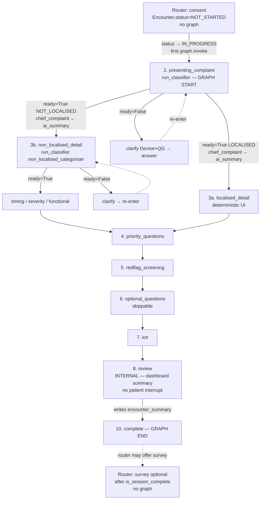

**Graph nodes (9):** `presenting_complaint` · `localised_detail` · `non_localised_detail` · `priority_questions` · `redflag_screening` · `optional_questions` · `ice` · `review` · `complete`

**Router-level (not graph):** consent (before first invoke), survey (after graph complete). Helpers: `forms/`. Spec: [`ROUTER_SPEC.md`](ROUTER_SPEC.md).

**Patient-facing sequence frontend sees:**

1. consent (router) → 2. presenting_complaint (+ clarify) → 3a/3b → 4. priority → 5. redflag → 6. optional → 7. ice → *(silent review)* → 9. survey? (router) → complete

**`presenting_complaint` / `chief_complaint`:** Stage 1 stores the patient's free-text answer (`source: "free_text"`). On classifier `ready: true`, `map_classifier_result` overwrites `chief_complaint` with `chiefComplaintSummary` (`source: "ai_summary"`). Original patient wording stays recoverable in session `messages` (no separate DB column).

**Detail timing (3a/3b):** After routing, QG emits one adaptive `single_choice` duration question with 3–5 context-grounded chips plus `Other`. A chip answer writes `duration` with `source: "option"`; `Other` free text writes `source: "free_text"`. NL also asks deterministic severity + functional-impact scores; localised asks deterministic severity after the body diagram. NL categoriser clarify is capped at **3 rounds in code** (`non_localised_clarify_rounds` + lean force-commit) — see [ENGINE_NODES.md](../apps/api-server/ENGINE_NODES.md).

**Not patient-facing:** step 8 `review` — clinician `encounter_summary` only.
