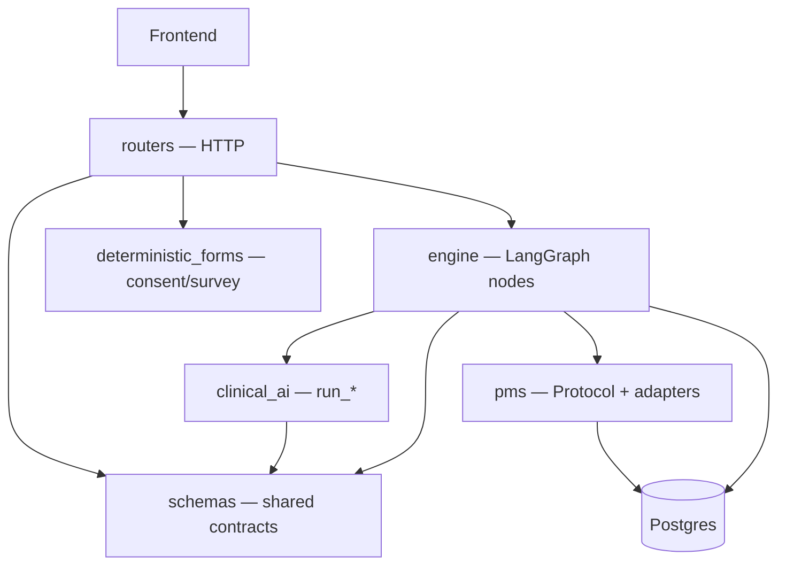
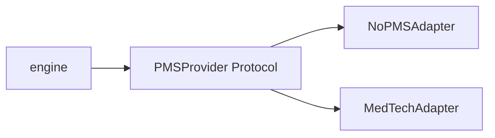
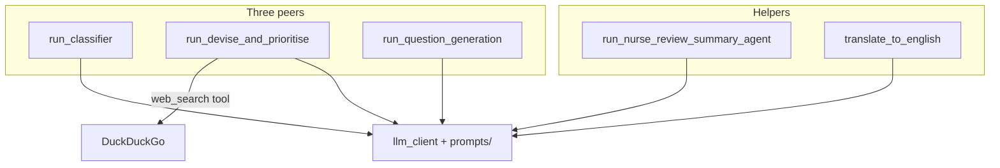
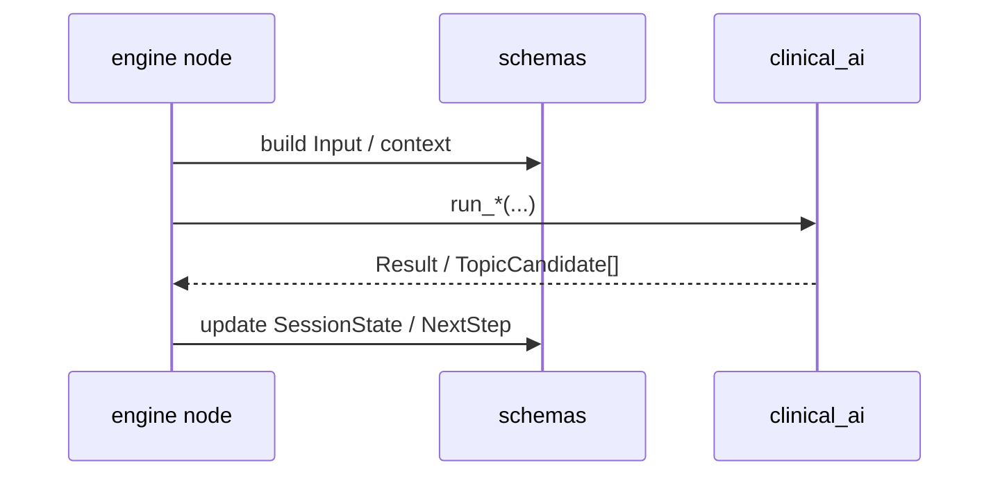

# Structure ideation

Scratchpad — not source of truth. Prefer `apps/api-server/README.md` for the live layout.

---

## 1. Layers

| Layer | Owns | Does not own |
| ----- | ---- | ------------ |
| **schemas** | Shapes everyone shares (`SessionState`, `NextStep`, agent I/O, `CollectTarget`, …) | LLM calls, DB writes, routing |
| **engine** | Clinical graph progress; map answers → state / graph NextSteps | Prompt text, Azure, PMS, consent/survey HTTP lifecycle |
| **deterministic_forms** (in engine/) | Consent/survey QuestionField builders for router | Graph topology |
| **clinical_ai** (runtime) | `run_*`, prompts, registry lists, tools | Graph topology, HTTP |
| **pms** (runtime) | Fetch/push behind `PMSProvider` | Clinical reasoning |

---

## 2. PMS — adapter

Plain I/O, no LLM. Swap adapter via org `pms_config.vendor` — engine stays the same.

---

## 3. Clinical AI — agents

Three peers + helpers. Red flag = Devise + QG with `phase=redflag_screening`, not a 4th agent.

Replace David/Kevin Devise later by swapping `run_devise_and_prioritise` body — keep `list[TopicCandidate]`. No Protocol.
