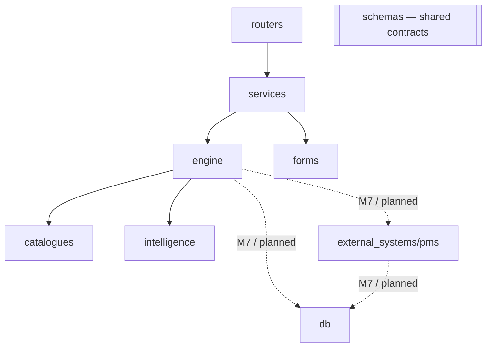
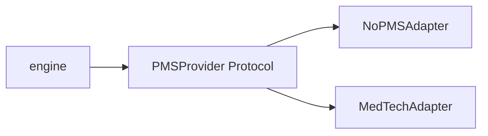
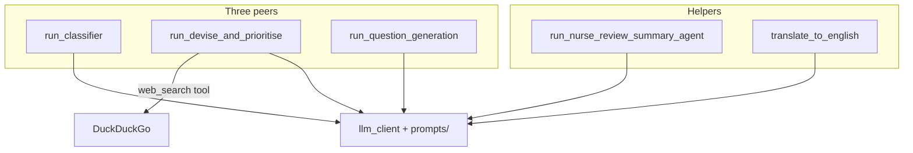
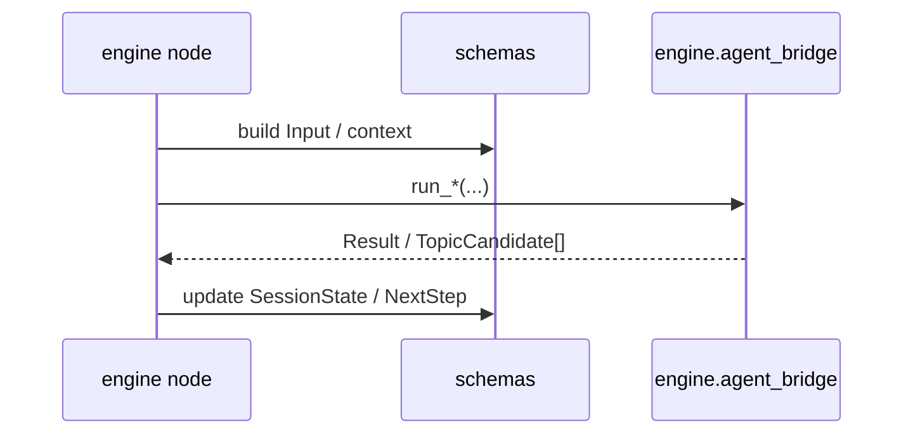

# Structure

---

## 1. Folders (api-server) — who calls whom

Arrow = runtime call / import of that package. `schemas` is shared by all folders above (not drawn as edges).

| Folder                    | Owns                                                                                                                        | Calls                                                  |
| ------------------------- | --------------------------------------------------------------------------------------------------------------------------- | ------------------------------------------------------ |
| **routers/**              | HTTP parse/validate; map exceptions → status codes                                                                          | `services`                                             |
| **services/**             | Encounter status machine; in-memory session/org store (M6); pick `SessionRunner` by `segment_type`                          | `engine`, `forms`                                      |
| **forms/**                | Consent/survey `QuestionField` builders (not graph nodes)                                                                   | None                                                   |
| **engine/**               | LangGraph clinical intake: nodes, topology, runner, checkpointer, `agent_bridge`, session_state_mappers, next_step / codecs | `intelligence` (via `agent_bridge` only), `catalogues` |
| **catalogues/**           | Body-diagram SVG region tables (prefill / coding)                                                                           | None                                                   |
| **intelligence/**         | Agents `run_`*, prompts, registry, QG validators, LLM client                                                                | None                                                   |
| **external_systems/pms/** | PMS Protocol + adapters (plain I/O)                                                                                         | None                                                   |
| **db/**                   | SQLAlchemy models / persistence                                                                                             | None                                                   |
| **schemas/**              | Shared contracts: Literals, `SessionState`, `NextStep`, agent I/O, collect targets                                          | None                                                   |

---

## 2. PMS — adapter

Plain I/O, no LLM. Swap adapter via org `pms_config.vendor` — engine stays the same.

---

## 3. Clinical AI — agents

Three peers + helpers. Red flag = Devise + QG with `phase=redflag_screening`, not a 4th agent.

Replace David/Kevin Devise later by swapping `run_devise_and_prioritise` body — keep `list[TopicCandidate]`. No Protocol. Nodes talk to AI only via `engine.agent_bridge`.